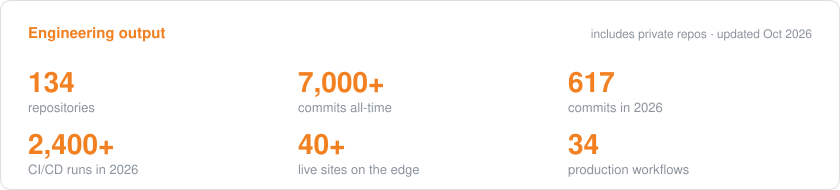
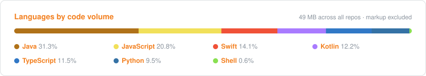
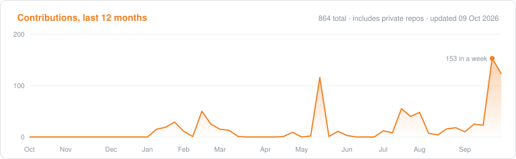

<h1 align="center">Rexhino Kovaci</h1>

<p align="center">
  DevOps Engineer &nbsp;·&nbsp; Software Developer &nbsp;·&nbsp; AI Engineer<br/>
  Tirana, Albania &nbsp;·&nbsp; Founder of <a href="https://modex.al">Modex Apps</a>
</p>

<p align="center"><b>DevOps &amp; AI engineer shipping live products from Albania to clients across the Balkans and Europe.</b></p>

<p align="center">
  <a href="#selected-work">Selected work</a> &nbsp;·&nbsp;
  <a href="#experience--certifications">Experience</a> &nbsp;·&nbsp;
  <a href="#hire-me-to-build-it">Services</a> &nbsp;·&nbsp;
  <a href="#faq">FAQ</a> &nbsp;·&nbsp;
  <a href="mailto:kovacirexhino@gmail.com">Contact</a>
</p>

<p align="center">
  <a href="mailto:kovacirexhino@gmail.com"></a>
  <a href="https://modex.al"></a>
  <a href="#hire-me-to-build-it"></a>
</p>

---

I'm a DevOps engineer, mobile app developer and AI engineer based in Tirana, Albania, working with clients across the Balkans and Europe. I build and run products end to end: native mobile apps, edge backends, web, CI/CD and the AI pipelines that keep them fresh. One person, one stack, shipped to the App Store, Google Play and the edge.

```yaml
role:      [devops, full-stack, mobile, ai-engineering]
based_in:  Tirana, Albania
shipping:  iOS · Android · Wear OS · watchOS · Web · Serverless APIs
cloud:     AWS · GCP · Azure · Cloudflare · Kubernetes · Terraform · Docker · GitHub Actions
ai:        LLM agents on daily schedules for content, SEO, QA and data curation
currently: scaling a portfolio of localized word games and utility apps across Europe
```

### By the numbers



Shipping in 7 languages: Albanian, Greek, German, Italian, Romanian, Serbo-Croatian and Danish.

### Experience & certifications

- **5+ years in DevOps**, building and running CI/CD, cloud infrastructure and monitoring for production systems.
- **DevOps Engineer at Lufthansa Industry Solutions** (2022–2024), working on Volkswagen AG projects.
- **Founder of [Modex Apps](https://modex.al)**, part of the Startup Albania program, with 30+ apps and games published on the App Store.

| Certification | Issuer |
|---|---|
| DevOps Engineer Expert | Microsoft |
| Azure Administrator Associate | Microsoft |
| Azure Developer Associate | Microsoft |
| Terraform Associate | HashiCorp |
| Full-Stack Observability | New Relic |

### Selected work

| Product | What it is | Platforms |
|---|---|---|
| [**Nearby Lens**](https://nearby-glasses-alert.pages.dev) | Detects camera-equipped smart glasses over Bluetooth LE, with over-the-air detection rules · [case study](https://github.com/rexhinokovaci/nearby-lens-case-study) | iOS · watchOS · Android · Wear OS |
| [**Kush Jam Unë?**](https://kushjamune.pages.dev) | The #1 Albanian party guessing game, 4,000+ cards backed by D1 · [case study](https://github.com/rexhinokovaci/kush-jam-une-case-study) | iOS · Android · Workers |
| [**Balkans Quiz**](https://balkansquiz.pages.dev) | Per-country trivia apps with Apple Watch and widgets, fed by an automated question pipeline · [case study](https://github.com/rexhinokovaci/balkans-quiz-case-study) | Web · Workers · Pages |
| **Word game series**: [Shtet·Qytet](https://shtet-qytet.pages.dev) · [Χώρα·Πόλη](https://hora-poli.pages.dev) · [Stadt·Land·Fluss](https://stadt-land-fluss-67w.pages.dev) · [Nomi·Cose·Città](https://nomi-cose-citta.pages.dev) · [Država·Grad](https://drzava-grad.pages.dev) · [Țară·Oraș](https://tara-oras-e8g.pages.dev) · By·Land·Flod | One engine, localized per market: live multiplayer, solo mode, self-updating dictionaries · [case study](https://github.com/rexhinokovaci/word-game-engine-case-study) | iOS · Android · Web · Workers |
| [**Balkan AI**](https://balkan-ai-web.pages.dev) | AI travel guide for the Balkans | Web · Workers |
| [**Briefly**](https://briefly-hjn.pages.dev) | 590+ book summaries, about 14 minutes each | Mobile · Web |
| [**Haven**](https://haven-a0a.pages.dev) | A safe space for your mind | Mobile · Web |
| [**Momo Abetare**](https://momo-abetare.pages.dev) | Learn the Albanian alphabet, for kids | Web |
| [**Modex**](https://modex.al) | Albanian-language AI and business manuals | Web |
| [smart-city-albania](https://github.com/rexhinokovaci/smart-city-albania) | Open-source public cameras, places and live city data | Open source |

### Hire me to build it

I'm taking on new client projects. You get one senior engineer from idea to launch, with no hand-offs between agencies.

| I build | Typical projects |
|---|---|
| 📱 **Mobile apps** | Native iOS & Android (Swift, Kotlin), watchOS & Wear OS, in-app subscriptions, App Store & Google Play release |
| 🌐 **Web apps & SaaS** | Dashboards, marketplaces, booking & internal tools, landing pages that convert, auth, payments, admin panels |
| 🤖 **AI products & agents** | Chatbots on your own data (RAG), AI agents that do real work, automations for content, support & ops, AI features inside existing apps |
| ☁️ **Cloud & DevOps** | CI/CD, AWS · GCP · Azure · Cloudflare, Kubernetes & Terraform, cost cuts, migrations, monitoring |

**Why clients can trust it**
- Every product above is live. Install the apps and try the sites before we talk.
- Production-grade from day one: tests, CI/CD and security checks, deployed to your cloud. You own the code and the accounts.
- Built for European markets: shipping in 7 languages, with localization and store releases handled.
- Most of my code is private, so I'll walk you through real pipelines and codebases on a call.

**Start a project:** email what you want to build, your timeline and your budget range. I reply within 24 hours with next steps.

<p>
  <a href="mailto:kovacirexhino@gmail.com?subject=New%20project%3A%20mobile%20%2F%20web%20%2F%20AI&body=What%20I%20want%20to%20build%3A%0ATimeline%3A%0ABudget%20range%3A"></a>
</p>

### How I ship

```
 commit ──► GitHub Actions ──► validate / test / security gate ──► any cloud: AWS · GCP · Azure · Cloudflare
   ▲                                                                                   │
   └──── AI routines open PRs (content, SEO, data) ◄── health checks ◄─────────────────┘
```

- Cloud-agnostic: the same pipeline targets serverless, containers or Kubernetes on whichever provider fits the product.
- Every product deploys from CI. Nobody touches production by hand.
- AI agents generate on a schedule. Policy checks decide what auto-merges.
- Health checks and dependency gates run daily, so drift is caught before users see it.

### FAQ

#### Where are you based, and do you work with clients abroad?

Tirana, Albania (Central European Time). I work remotely with clients across the Balkans and the rest of Europe.

#### What kind of projects do you take on?

Mobile apps (iOS, Android, watchOS, Wear OS), web apps and SaaS, AI products and agents, and cloud & DevOps work such as CI/CD, Terraform, Kubernetes and migrations on AWS, GCP, Azure or Cloudflare. See [Hire me to build it](#hire-me-to-build-it).

#### Can you work on an existing app or infrastructure, not just new builds?

Yes. Adding AI features to an existing app, setting up CI/CD, cutting cloud costs and migrating between providers are all part of the services above.

#### Who owns the code?

You do. Everything is deployed to your cloud, and you own the code and the accounts.

#### Can I see your code before hiring you?

Most of my code is private, so I walk you through real pipelines and codebases on a call. The [case studies](#selected-work) describe the architecture of live products, and every app and site listed is live to try.

#### How do we start?

Email what you want to build, your timeline and your budget range to [kovacirexhino@gmail.com](mailto:kovacirexhino@gmail.com). I reply within 24 hours with next steps.

### Stack

<p>
  <br/>
  <br/>
  <br/>
  
</p>

### Activity





---

<p align="center"><sub>Most of my work lives in private repos. If you want a walkthrough, a collab or a contract, <a href="mailto:kovacirexhino@gmail.com">get in touch</a>.</sub></p>
